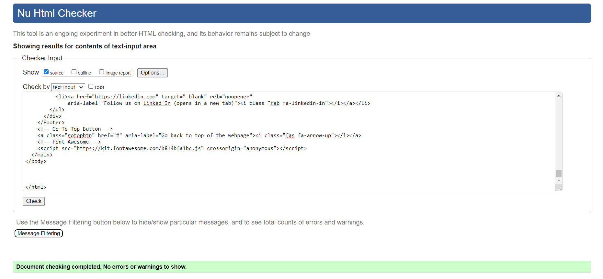

# The English Football Club

The English Football Club's website is to promote their training sessions for children, between the ages of 7-10, living in Göteborg (Gothenburg), Sweden. The unique selling point of The English Football CLub, is that all training sessions are held in English.

The site is targeted at parents of children who are looking for a sporting activity that will get their children outside and running and participating within teams. The site will display key information about the training sessions, prices, the coaches, and the location of said sessions. The site will also give parents the opportunity to sign their child(ren) up to participate.

The website was made using the 'Mobile-First' concept. The idea being that the website is mobile friendly always. The content will be less on a mobile screen, and more information will be displayed as the screen gets larger. This is also to make the website fully responsive.

Link to the live [The English Football Club - Website](https://totallysly.github.io/portfolio-project-one/)

## Table of Contents
  * [UX and UI Design](#ux-and-ui-design)
    * [Owner Goals](#owner-goals)
    * [External User Goals](#external-user-goals)
    * [User Stories](#user-stories)
    * [Potential Features to Use](#potential-features-to-use)
    * [Wireframes](#wireframes)
  * [Design](#design)
    * [Imagery](#imagery)
    * [Colour Scheme](#colour-scheme)
    * [Typography](#typography)
  * [Features](#features)
    * [Existing Features](#existing-features)
    * [Features Left To Implement](#features-left-to-implement)
  * [Testing](#testing)
    * [Validator Testing](#validator-testing)
    * [Manual Testing](#manual-testing)
    * [Accessibility](#accessibility)
    * [Bugs](#unfixed-bugs)
  * [Deployment](#deployment)
  * [Credits](#credits)
    * [Content](#content)
    * [Media](#media)
    * [Acknowledgments](#acknowledgements)

## UX and UI Design

The owner of the company tasked me with designing and implementing a colourful, snappy, and to the point website. I agreed that this was best fit for their, and their user needs. The company itself is self-explanatory. They host football training in English for children (company based in Sweden). The website needed to reflect this, and did not need to create an informational overload for the user of the website. The owner required a website to detail prices, locations, and for parents to sign their child(ren) up to join the fun.

With this in mind, it was clear that the website required colourful imagery, bold colouring, and minimal text content. All content had to be 'to the point' and quickly at hand for the user.

### Owner Goals

- To allow users to sign their child up to join the training sessions.
- To display their USP - The only English speaking football training in Göteborg (Gothenburg).
- To display how quickly the company has developed in a short period of time.
- To include a profile highlighting the credentials of the coaches.
- To include the coaches mobile numbers in case of an emergency for existing users.
- To display prices and any potential offers.
- To show the times and location of the training sessions.

### External User Goals

- To sign up their children for the football training sessions.
- Read about the company and coaches credentials.
- See the cost of the training sessions.
- See the location of the training sessions.
- Quick access to the coaches mobile numbers in case of emergency.

### User Stories

- As a user of the website, I want to be able to easily navigate around the website.
- As a user of the website, I want to be able to sign up my child(ren) for the training sessions.
- As a user of the website, I want to find out about the coaches running the website.
- As a user of the website, I want to know the prices of the training sessions.
- As a user of the website, I want to know where the training sessions are located.

### Potential Features to Use

- A sign-up form for the user and owner to receive information regarding new members to the training sessions. 
- Profiles of the coaches.
- Google Maps embedded to show the location of the training sessions.
- Links to different Social Media related to the club.

### Wireframes

All three of my wireframes are very basic mock-ups. I was concerned with creating the layout, rather than a content. 

I originally drew my mock-ups by hand. I then created a digital mock-up using Balsamiq.

  
Desktop Wireframe

 
Tablet Wireframe

 
 

 
Mobile Wireframe

## Design

### Imagery

I sourced my imagery from two different stock image websites, Unsplash and Pexels, respectively. I reduced the file size of my images using TinyPNG, a compression website. I used the .png image file type to maintain a high image quality whilst reducing the size of each individual image file. This will improve the speed and loading times of the website.

I wanted images that best represented football sessions for children between 7 and 10 years old. I wanted to use vibrant images. I wanted fun images. I wanted sunny images. I wanted colourful images. Initially, I opted out of using images that clearly showed the faces of any children. This was a personal ethical preference, as I didn't think it sat right. 

The images collated helped to further present the story of the website. They visually demonstrate a fun and vibrant social gathering for children, where they will take part in football training sessions.

The colours in the imagery helped with the final decision of my colour scheme.

### Colour Scheme

In choosing my colour palette, I used the website ' Coolors.co'.

I wanted colours that had a strong relationship with football teams traditional colours. 

Initially, I could not settle between a red or blue colour pallette. I settled with blue for two reasons. The first being that red is quite a powerful colour. Visually, it can be rather distracting and make the website less accessible for all users. Secondly, a lot of the imagery I used had powerful blue colours, with white being secondary. To help maintain a great visual design I opted for blue.

I felt that these colours best represented a 'warmer' blue, had they had a strong association with football. These colours provided great visual readability of all aspects of the website. There is a good collection of background colours, text colours, and overlay styled colours.

  - '1B264F'
    - Main background colour. Used for the logo and block backgrounds.
  - '274690'
    - Text overlay colour.
  - '576CA8'
    - Navigation bar colour.
  - 'F5F3F5'
    - Text/font colour. 

### Typography

I used Google Fonts to select my fonts.

I like sleek and minimalist font styles. I narrowed down my search for these style of fonts. The font that instantly stood out was 'Raleway'. I used Google's popular pairings with 'Raleway'. Upon testing each selection, I settled on pairing 'Raleway' with 'Montserrat'.

The two fonts provided a nice and subtle difference. Due to its default font-weight, 'Montserrat' would be fantastic to use for the logo and each heading on the website. 'Raleway', with its slim minimalist feel, would be great to use for the main content of the website.

## Features

### Existing Features

- __Logo__
  
  -The logo is a simple font based logo to keep with a more minimalist and sleek design. The logo also doubles up as a navigational link, to allow the user to always return to the home page.

- __Navigation Bar__
  
  - The navigation bar is featured on both pages of the website. The main page of the website is a single page website, which the navigation links will help the user    jump down to each specific section. 
  - The sections include, 'Home', 'About Us', 'Coaches and Contact Us', 'Prices', 'Training Times', and 'Sign-Up'. The 'Sign-Up' directs the user to a new page. The navigation bar retains the same position and style on both pages, allowing for good accessibility.

- __Landing Page Image__

  - The landing image is a photograph with a text overlay. This provides the user with instant information,  'what the site is about', 'age range', and 'location of the training sessions'. This allows the user instant clarification regarding the site.
  - This section provides a large football training related photo that is colourful and eye-catching. The image colours also maintain the colour theme of the website. The center piece of the image, shows a nice light blue, with tones of white being the secondary stand-out colour.
  - For mobile devices I opted for the text overlay to have a bold background colour and to sit on top of the landing page image. I chose this design as it felt that this information would be read instantly when the user access the website on a mobile device. It also maintains a visual balance of block text, image, block text etc achieved with the website. 

- __About Us__

  - This provides the user with quick facts about The English Football Club. It establishes the success the club already has had allowing a sense of ease for the user.
  - It shows how the club is diverse and inclusive, to help put parents minds at ease.
  - The second is a block background with font. I wanted to keep a minimalist approach, with straight to the point text. Information is clear, concise and can be read easily.

- __Coaches & Contact Us__

  - This is to provide users with a quick look at who the coaches are at The English Football Club. It provides a profile photo, mobile contact, and email address.
  - On tablets and above, there is extra information regarding the coaches. This follows the styling of the 'About Us' section. Quick, bite-sized facts establishing the coaches credentials. Only profile photos, mobile and email contact details are visible for mobile devices. This is to provide the most important information to the user if accessing on a mobile. Also, if a user needs to get in contact with a coach, the information is present without any distracting information.
  - In keeping with the visual design of this website, the background image is zoomed in. Each coach information is separated within their own box stacked on top of each other. The opaque background allows the content to be visible as a text overlay of the image. Again, maintaining visual design patterns.

-__Prices__

  - Lorem
  - Lorem
  - Lorem

-__Training Times__

  - Lorem
  - Lorem
  - Lorem

-__Footer__

  - Lorem
  - Lorem
  - Lorem

-__Sign-Up Page__

  - Lorem
  - Lorem
  - Lorem

### Features Left To Implement

  - Lorem
  - Lorem
  - Lorem

## Testing

  - Write about how the website works and I need to convince the assessor that I have successfully conducted tests on the website for all devices and browsers.

### Validator Testing

  HTML
    

      
'index.html' - Zero Errors

      
    

    

    
'sign-up.html' - Zero Errors

    
    

        

    
'form-submit.html' - Zero Errors

    
    

            

    
'404.html' - Zero Errors

    
    

  CSS
    

      
'styles.css' - Zero Errors

      
    

    

      
'styles.css' - 1 Warning

      
    

  This is due to importing Google Fonts onto the CSS stylesheet. The W3Schools Jigsaw Validator does not check imported style sheets.

### Manual Testing

The site was manually tested throughout production. This included ensuring 
   - All navigation links corresponded to the correct part of the website. 
   - The sign-up form had the necessary required attributes, ensuring all data needed was submitted.
     - The 'sign-up!' button directed to the correct page, telling the user that we had received their data.
   - A working Error 404 page, with a link directing the user back to the homepage.

Responsive testing was conducted on a Windows Laptop, iPhone 7, iPhone 7 plus, and a Samsung Galaxy Tab A8. As these devices are limited to their screen sizes. I also tested the responsiveness using Google Dev Tools and [Responsive PX](http://www.responsivepx.com/).

Testing was conducted on Google Chrome, Mozilla Firefox and Safari web browsers.

After website completion, I submitted the website to Code Institute's Slack Community, specifically the 'Peer-Code-Review' channel. 

### Accessibility

The website passes on all aspects of accessibility and colour contrast. 

Lighthouse Testing

  

  
'index.html' - Desktop

  
  

  

  
'index.html' - Mobile

  
  

  

  
'sign-up.html' - Desktop

  
  

  

  
'sign-up.html' - Mobile

  
  

  

  
'formsubmit.html' - Desktop

  
  

  

  
'formsubmit.html' - Mobile

  
  

  

  
'404.html' - Desktop

  
  

  

  
'404.html' - Mobile

  
  
  

 
Wave

  

  
'index.html'

  
  

  

  
'sign-up.html'

  
  
 

  

  
'form-submit.html'

  
  

  

  
'404.html'

  
  
  
  
### Bugs

I had a lot of issues with the Sign-Up Form. It took me a long time to come to a final solution of having a fully responsive form for all media devices.

- Bug 1 - Hero Image
  I had issues with my original hero image. Due to context of the image, and the pixel size, it created an off-balance look. It overcome this, I opted for a different hero image. Upon speaking with the test users and owners, they agreed that the new hero image was better for the overall story of the website.
  
   

- Bug 2 - Coaches & Contact Us
  I had issues with the content for each coach. I solved this by using Flexbox. I also opted to remove the coaches' facts on mobile devices. This is so contact information is clearly seen by the user. 
  
   
 - Bug 2 - Sign-Up Form
  Position: Relative' and 'Position: Absolute'. For Desktop and Tablets there was no issue. However, on Mobile devices, the sign-up form was off the page, or loading over the footer. I solved this issue by removing the background image and using a background colour instead. I also made a smaller font-size, and managed to move the Position: Absolute toward the left side.

 

 - Bug 3 - Navigation Bar
  I had issues regarding the Navigation Bar for Mobile Devices. I used Flexbox in order to create the Nav bar, however, on a Mobile device it looked too 'busy' with messy ordering. I opted to change the Nav bar to a column on Mobile devices. This was a better representation. Using two different iPhones, I was able to use the links without any difficulty. This could be a future bug, as I note that it was the Nav bar that hindered my 100% scores to mid 90s on Lighthouse. Going forward, I would like to implement a 'Hamburger' Nav bar for Mobile devices. Upon research, JavaScript is required for this. After immersing myself into JavaScript, this bug will be corrected, and as such achieve 100% on Lighthouse.

   

- Bug 4 - W3Schools Validator
  After running my code through the validator. It returned several 'typos' within the code itself. This included:
    - Unclosed Divs.
    - Divs within the Fieldset and Legend
    - 'Di' being typed instead of Divs. 

## Deployment

  - How deployed via GitHub
  
    - The site was deployed to GitHub pages. The steps to deploy are as follows:
      - In the GitHub repository, navigate to the Settings tab
      - From the source section drop-down menu, select the Master Branch
      - Once the master branch has been selected, the page will be automatically refreshed with a detailed ribbon display to indicate the successful deployment.

- The link:
  - [The English Football Club - Website](https://totallysly.github.io/portfolio-project-one/)

## Credits

  - Credit and reference any additional websites in which you got extra help from. Need to be very specific in regards to code used externally.
  
### Content

  - All written content is purely fictional. I created the written content myself as the company is also fictional. 
  - The training section was inspired by a section of tutorial project, [Love Running](https://github.com/Code-Institute-Solutions/love-running-2.0-sourcecode/tree/main/05-meetup-times), via the Code Institute.
  - A lot of research was placed on [Stack Overflow](https://stackoverflow.com/), [W3Schools](https://www.w3schools.com/), [Mozilla Developer](https://developer.mozilla.org/en-US/).
    - In addition several YouTube videos:
      - [Web Dev Simplified](https://www.youtube.com/c/WebDevSimplified/playlists) (Flexbox, Absolute/Relative Position).
      - [Kevin Powell](https://www.youtube.com/kepowob). (Flexbox, Absolute/Relative Position)
      - [Minim](https://www.youtube.com/watch?v=VX_Dghv65Vk&list=PL4cTxE4s2XIYJL6uPQUwMt25M70gPl-O6&index=14&ab_channel=Minim). (Sign-Up form).

https://thoughtbot.com/blog/positioning#position
https://coder-coder.com/display-divs-side-by-side/#flexbox-method
https://css-tricks.com/snippets/css/a-guide-to-flexbox/
https://webdesign.tutsplus.com/tutorials/a-comprehensive-guide-to-flexbox-sizing--cms-31948
https://gist.github.com/basham/2175a16ab7c60ce8e001
https://blog.duda.co/responsive-google-maps-for-your-website

http://www.responsivepx.com/

https://stackoverflow.com/questions/6370690/media-queries-how-to-target-desktop-tablet-and-mobile

https://www.youtube.com/watch?v=Vef9bxTilCU&ab_channel=DarkCode - SCROLL TO TOP BUTTON

https://dev.to/uma/responsive-form-using-html-and-css-4l59 - FORM HElP. ALSO LOVE RUNNING

  - 
  - Icons where via the amazing website - [Font Awesome](https://fontawesome.com/).
  - The colour palette was from [Coolors](https://coolors.co/)

### Media

  - My images were from two stock image websites: [Pexels](https://www.pexels.com/) and [Unsplash](https://unsplash.com/).
  - Write about each photo image.

Landing Image [Ruslan Alekso](https://www.pexels.com/@oskelaq)
Coaches Background Image [Ralph (Ravi) Kayden](https://unsplash.com/@ralphkayden?utm_source=unsplash&utm_medium=referral&utm_content=creditCopyText)
Coach Richards Image [Midas Hofstra](https://unsplash.com/@midashofstra)
Coach Edwards Image [Ben Den Engelsen](https://unsplash.com/@benjeeeman)
Training Times Image [Mike](https://www.pexels.com/@mike-468229)
Sign-Up Background Image [Kampus](https://www.pexels.com/@kampus)
  
### Acknowledgements

I would like to thank my Code Institute mentor Antonija Simic for her help and guidance during this project.

I would like to thank the Code Institute Slack community for all their support and help with various general questions I have asked thus far.

A deep dive of various README files from the CI community. Especially in learning Markdown and layout structure. 

